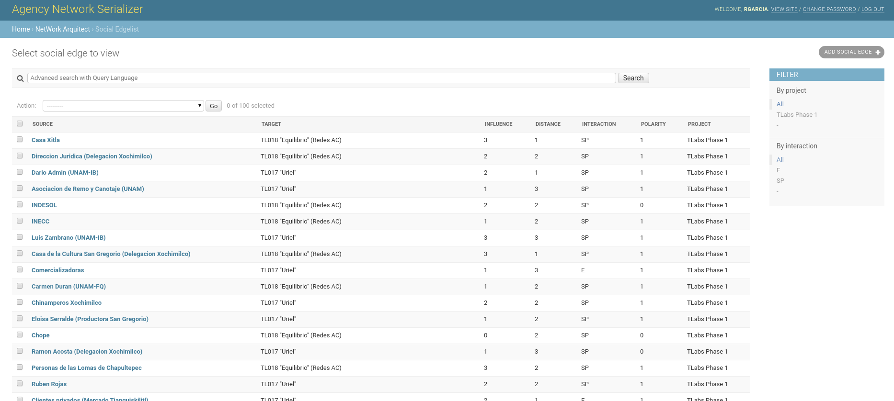
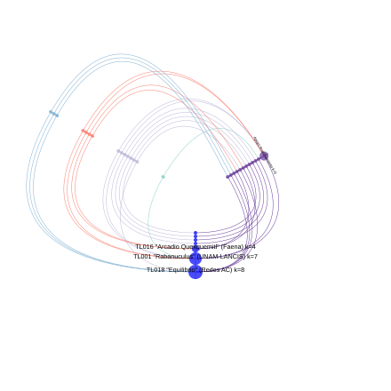

# Agency Network Serializer

This is a web application for the creation and managing of Agency Networks.

For an intro you might want to read the [Agency Network Analysis Vignette](https://steps-centre.org/pathways-methods-vignettes/agency-network-analysis/).

AgNeS is a tool for colaboration through which users can capture data
into a database, which can then be queried with arbitrary filters to
construct, visualize and export complex networks.

You may [use our AgNeS server](http://agnes.apps.lancis.ecologia.unam.mx/), hosted by [LANCIS](https://lancis.ecologia.unam.mx/).

Or you may run it on your own infrastructure. Here are [installation instructions](INSTALL.md).

## Database

AgNeS uses a relational database to store network data. This maintains
consistency across tables and avoids data redundancy.

Complex networks are represented as edgelists. Four are included:

 - Agency edgelist
 - Social edgelist
 - Avatar power edgelist
 - Mental model edgelist

Each is represented by a table that holds the relationship among
entries in other tables.

This is the table scheme:

AgNeS provides web forms to capture and manage data into each of these
tables.

The following screenshot shows an agency edgelist. Notice how it
connects people with actions through other people. 

These three categories of nodes can be represented in a hiveplot for easier analysis.

## Exporting and Visualization

By selecting edges from edgelist tables users may export data into
common formats suitable for complex network analyses using other
software:

 - [GraphML](http://graphml.graphdrawing.org/), suitable for [Cytoscape](https://cytoscape.org/)
 - Format suitable for [Pajek](http://vlado.fmf.uni-lj.si/pub/networks/Pajek/)
 - [DOT](https://en.wikipedia.org/wiki/DOT_%28graph_description_language%29), suitable for [GraphViz](https://graphviz.org/)

Special visualizations can also be obtained directly from AgNeS:

 - Hiveplot, for agency networks
 - HeatMap, suitable for comparisons of mental models
 - Force-embeded, both in PDF and interactive formats

